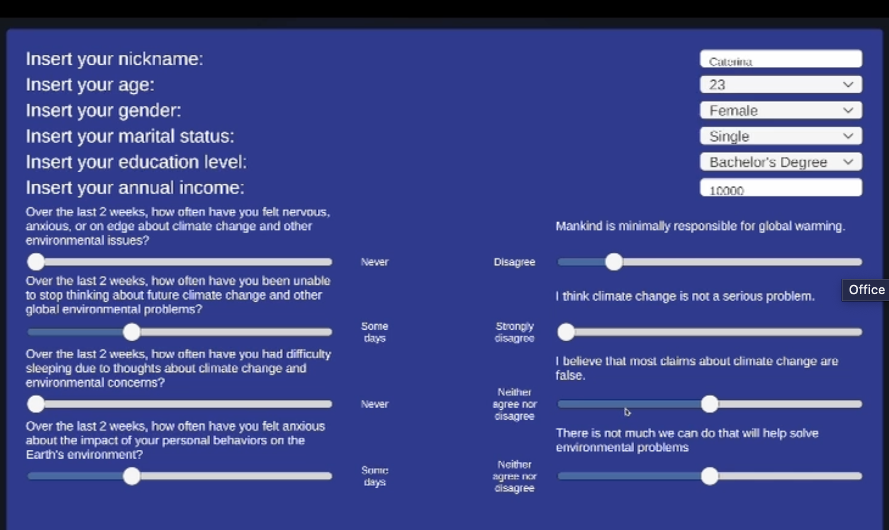
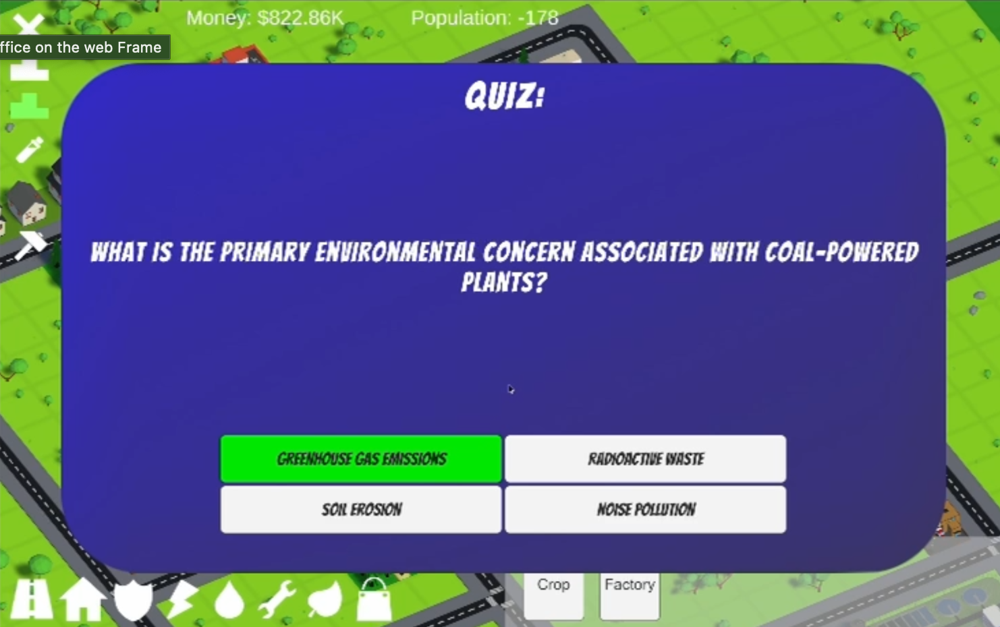

E-health Project - EcoCity
==============================

Ecocity is a game where you can build your own green city! Your success depends on the choices you make and your knowledge of sustainability and ecology. Experience our open-source game by downloading the executable now. Join the green revolution!
<center>
    
    
    
</center>

 
<!-- TABLE OF CONTENTS -->
<details>
  <summary>Table of Contents</summary>
  <ol>
    <li>
      <a href="#about-the-project">About The Project</a>
    </li>
    <li>
      <a href="#prerequisites">Prerequisites</a>
    </li>
    <li><a href="#authors">Authors</a></li>
  </ol>
</details>


<!-- ABOUT THE PROJECT -->
## About The Project

We present the design and development of a serious game in Unity 3D about climate change, taking into consideration the effects it has on people.
We implement personalisation by developing a Python tool that starts from a given set of questionnaires. Additionally we took in consideration some catasrophical phenomenon, such as heatwaves, or floods that will occurr with a probability that is appropriately set with respect to your level of sustainability awareness. 

<p align="right">(<a href="#readme-top">back to top</a>)</p>


<!-- PREREQUISITES -->

## Prerequisites

Install packages in requirements.txt
  ```
  scipy
  numpy
  seaborn
  sklearn
  ```
Unity version(Editor): 2022.3.10f1


<!-- Authors -->
## Authors

* [Alice Carcone](https://github.com/alicecarcone)
* [Caterina Giardi](https://github.com/categrd)
* [Clarysse Allyssa Sarmiento](https://github.com/)
* [Sofia Sonnacchi](https://github.com/sofiasonnacchi)
* [Massimo Verzeni](https://github.com/massimo303)

<p align="right">(<a href="#readme-top">back to top</a>)</p>

